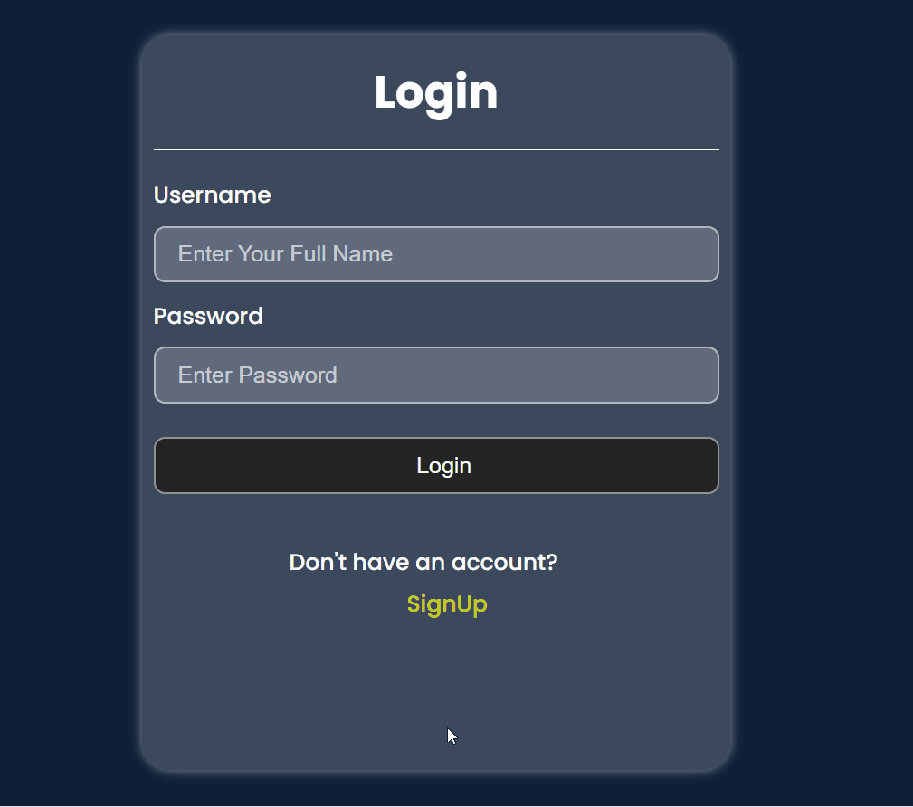

# 🎯 Watchwise

**Watchwise** is a movie and TV show recommendation system that helps users discover content tailored to their tastes.  
It leverages machine learning and similarity-based recommendations to suggest titles you’re most likely to enjoy.

---

## 📌 Features
- 🔍 **Content-based recommendations** – Suggests movies/series based on similarity to titles you’ve liked.
- 🎥 **Extensive metadata** – Uses genres, cast, crew, and more for accurate matching.
- 📊 **Preprocessed similarity model** – Optimized for fast results.
- 🌐 **Web interface** – Simple and intuitive user interface built with Django.
- 📁 **Structured data pipeline** – Easy to integrate new datasets.

---

## 🛠️ Tech Stack
- **Backend**: Django (Python)
- **Frontend**: HTML, CSS, JavaScript
- **Database**: PostgreSQL (or SQLite for development)
- **Machine Learning**: scikit-learn, pandas, numpy
- **Model Storage**: Pickle (similarity matrix) *(ignored in repo to avoid large file size issues)*

---
## Demo




## 🚀 Installation & Setup

1. **Clone the repository**
   ```bash
   git clone https://github.com/your-username/Watchwise.git
   cd Watchwise
